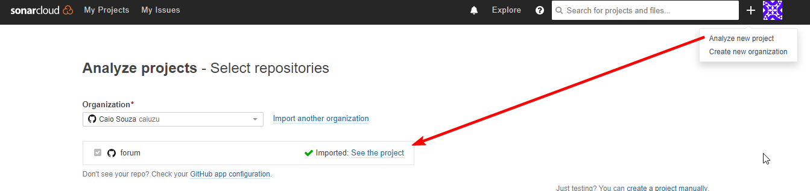
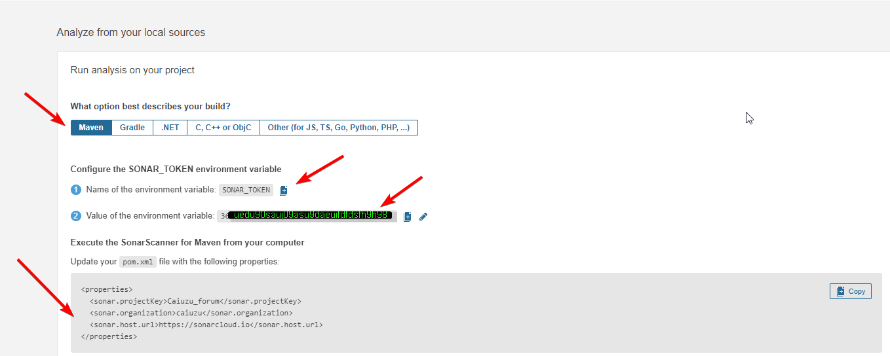
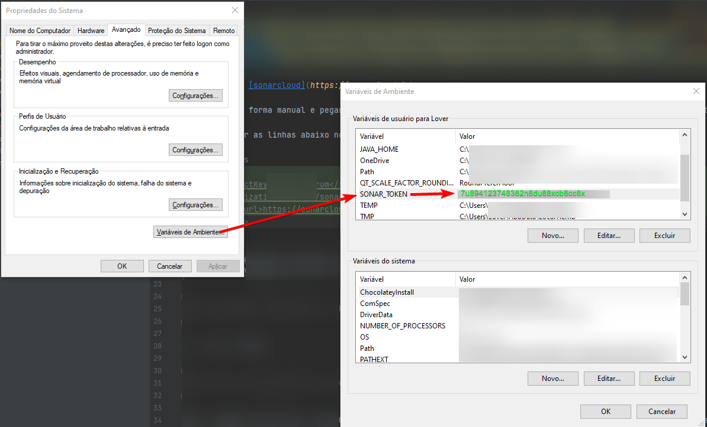
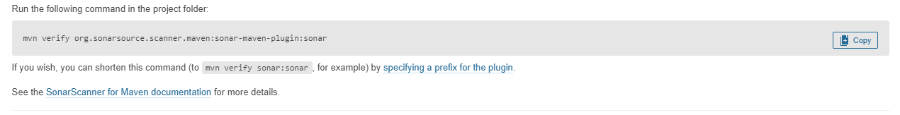

[](https://sonarcloud.io/dashboard?id=Caiuzu_forum)
[](https://sonarcloud.io/dashboard?id=Caiuzu_forum)
[](https://sonarcloud.io/dashboard?id=Caiuzu_forum)
[](https://sonarcloud.io/dashboard?id=Caiuzu_forum)

# Configurando [sonarcloud](https://sonarcloud.io):
###### Windows 10:



0 - gerar de forma manual e pegar o token (caminho para este projeto: https://sonarcloud.io/project/configuration?analysisMode=GitHubManual&id=Caiuzu_forum)



**1 - adicionar as linhas abaixo no pom.xml**

```properties
<properties>
<sonar.projectKey>Caiuzu_forum</sonar.projectKey>
<sonar.organization>caiuzu</sonar.organization>
<sonar.host.url>https://sonarcloud.io</sonar.host.url>
</properties>
```

**2 - seta a variavel de ambiente do sonar_token**



**3 - Setar JAVA_HOME como java11 com o comando abaixo:**

```
set JAVA_HOME=C:\Users\Lover\.jdks\adopt-openjdk-11.0.10
```

**4 - Rodar o mvn verify:** 

```
mvn verify org.sonarsource.scanner.maven:sonar-maven-plugin:sonar -Dsonar.login=%SONAR_TOKEN%
```



**Obs.:** _Apartir desta data o SonarCloud considera o java8 depreciado, sendo assim, para projetos utilizando java8, devemos apenas rodar o comando como java11._